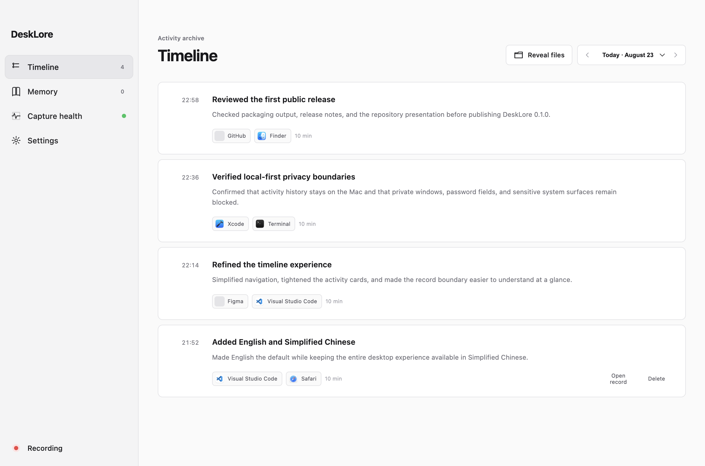

<div align="center">
  
  <h1>DeskLore</h1>
  <p><strong>你的电脑记忆，归你所有，供你信任的 agent 使用。</strong></p>
  <p>开源的 macOS 个人上下文基础设施。本地、有证据、可删除、属于你。</p>
  <p><a href="README.md">English</a></p>
</div>

<p align="center">
  
</p>
<p align="center"><sub>真实 DeskLore 界面，时间线内容全部为合成数据。</sub></p>

DeskLore 是个人上下文的开源基础设施。它通过 macOS Accessibility 语义而不是录屏，观察你在
Mac 上做的事，把它们生长成一份存在你自己机器上的记忆，全部是普通文件。记忆里的每一句话都能
追溯到证据，也能随证据一起删除。DeskLore 自己先用这份记忆，你信任的 agent 也可以在你授权的
范围内使用它。

目前发布的是证据层：可搜索、可切换粒度的时间线，以及经过引用校验的摘要。记忆层和它的出口，
包括主动提醒和 agent 访问，是 [docs/DIRECTION.md](docs/DIRECTION.md) 描述的方向。

> **当前状态：** [`0.2.0`](https://github.com/FoundDream/desklore/releases/tag/v0.2.0) 是面向
> macOS 14+、Apple Silicon 的早期源码版本，暂不提供官方签名安装包。

## 为什么是 DeskLore

- **记忆是产品，历史是它的证据。** 十分钟、六小时和当天三种粒度的时间线文档是被保留的证据，之后的每一条结论都必须引用它们。
- **语义采集优先。** 应用、窗口、交互、URL 和 Accessibility 上下文会被规范化为带证据的事件。截图只是回退，默认关闭。
- **默认本地。** 原始事件、Markdown 时间线、聚合总结和设置都保存在本机。
- **每道边界单独同意。** 用户未确认首次记录边界前，原生 Collector 不会启动；每一项会把数据发出本机的能力都是单独的决定。
- **按基础设施来建。** 证据生产者、记忆层和消费者是分开的层，格式稳定且带版本号，新的采集器和 agent 可以接入而不必重写内核。
- **中英文界面。** 默认使用英文，可在首次引导或设置中切换为简体中文。
- **结果可检查。** 时间线明细和聚合总结使用 Markdown，包含来源 ID，并提供确定性规则回退。

## 默认隐私边界

用户明确同意后，DeskLore 默认观察普通应用和 URL。DeskLore 自身、敏感 macOS
系统界面、隐私浏览窗口和密码字段会被排除，用户可以随时暂停。

| 能力             | 默认状态   | 网络访问                     | 保留期限                     |
| ---------------- | ---------- | ---------------------------- | ---------------------------- |
| 语义事件         | 同意后开启 | 无                           | 原始 segment 保留 48 小时    |
| 时间线与聚合总结 | 开启       | 使用确定性摘要时无网络       | 保留到用户删除               |
| 视觉补充         | 关闭       | 截图本身无网络；模型理解可选 | 文本证据 24 小时；像素不落盘 |
| 模型摘要         | 关闭       | 用户配置的 HTTPS endpoint    | 生成的 Markdown 保存在本机   |
| 遥测             | 不包含     | 无                           | 不适用                       |

删除单条时间线会同时删除源 segment 和相关视觉证据，受影响的聚合总结会重新生成。
“清空全部历史”会删除 raw、timeline、rollups 和 visual evidence，并保持暂停。完整说明见
[PRIVACY.md](PRIVACY.md)。

## 环境要求

- macOS 14 或更高版本
- Apple Silicon
- Node.js 24+
- pnpm 11+
- 包含 Swift 6.2+ 的 Xcode Command Line Tools

## 从源码运行

```bash
git clone https://github.com/FoundDream/desklore.git
cd desklore
pnpm install --frozen-lockfile
pnpm dev
```

首次启动时，DeskLore 会保持停止，直到用户确认本地记录边界。之后 macOS 会为内置原生组件
**DeskLore Collector** 请求一次辅助功能权限。只有用户主动开启 Visual fallback 时，才会另外请求录屏权限。

常用命令：

```bash
pnpm check           # 格式、lint 与 TypeScript 检查
pnpm test            # TypeScript、evaluator 与 Swift 测试
pnpm native:test     # 仅运行 Swift Collector/Core 测试
pnpm build           # 生产构建
pnpm package:mac     # 本地 DMG 与 ZIP；是否签名取决于本机 Keychain
```

## 架构

```text
React renderer
  -> 狭窄 preload API 与经过验证的 IPC
  -> Electron main
     -> ServerCore utility process
        -> policy、coalescing、storage、timeline、rollups、可选模型调用
        -> stdio NDJSON
           -> DeskLore Collector（Swift）
              -> Accessibility、AXObserver、NSWorkspace、全局交互事件
              -> 原生脱敏、可选 ScreenCaptureKit 补充
```

渲染层只接收脱敏 DTO；API Key 和原始 JSONL 不进入 renderer。Collector 与主应用使用不同
Bundle ID，让 macOS 独立完成原生采集边界的签名和权限识别。

源码布局、依赖规则、进程边界与数据所有权详见
[docs/ARCHITECTURE.md](docs/ARCHITECTURE.md)。

本地数据目录：

```text
~/Library/Application Support/DeskLore/history/
  segments/       # 十分钟 JSONL 原始桶，保留 48 小时
  timeline/       # 派生时间线 Markdown
  rollups/6h/     # 六小时总结
  rollups/day/    # 当天概览
  state/          # 同意、语言、范围、视觉和模型设置
```

DeskLore 尽可能使用仅所有者可访问的目录和文件权限，但不会对 timeline/rollups 额外做应用层加密。
如需磁盘静态保护，请开启 macOS FileVault。

DeskLore 的公开版本使用全新且带版本号的本地格式，不导入预发布 Computer History 构建产生的
数据或无版本设置。

## 可选模型与视觉能力

DeskLore 不需要 API Key 也能运行，确定性规则会离线生成时间线明细与聚合总结。只有用户主动开启
模型摘要时，过滤后的证据才会发送到用户配置的 HTTPS endpoint。API Key 使用 Electron
`safeStorage` 加密，不进入 renderer。
模型设置支持 OpenAI Responses 与 Chat Completions 两种线协议，也可以连接兼容的自定义
endpoint。

视觉补充拆成三个独立设置：

1. AX 充分性判断：默认本地规则，可选模型判断。
2. 窗口截图：默认关闭。
3. 视觉理解：关闭、本地 OCR 或用户明确配置的模型。

原始截图只在内存中处理，不写入事件文件。使用评测脚本前请阅读
[docs/EVALUATION.md](docs/EVALUATION.md)，不要把 manifest 或单次自动评分当作质量结论。

## 参与贡献

提交 PR 前请阅读 [CONTRIBUTING.md](CONTRIBUTING.md)。隐私、删除语义、原生权限边界和证据完整性
是本项目的兼容性契约。安全问题请按照 [SECURITY.md](SECURITY.md) 报告。

## 许可证

Copyright 2026 Ziwen Song。

使用 [Apache License 2.0](LICENSE) 开源。
