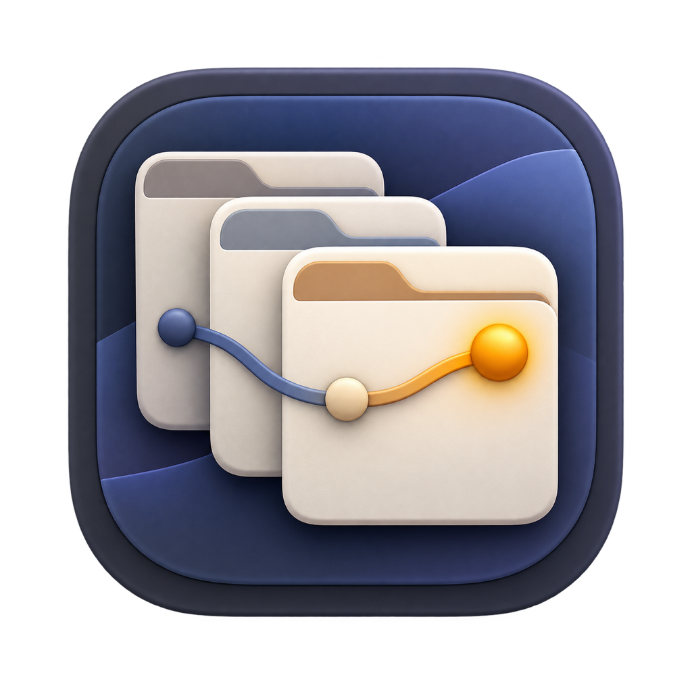

<div align="center">
  
  <h1>DeskLore</h1>
  <p><strong>开源的 macOS Computer History。</strong></p>
  <p>优先记录语义事件，不持续录屏，默认本地运行。</p>
  <p><a href="README.md">English</a></p>
</div>

DeskLore 把日常 Mac 活动整理成可搜索的时间线和分层记忆。它优先使用 macOS
Accessibility 语义，而不是持续录制屏幕。项目提供可选视觉补充，但默认关闭。

> **当前状态：** `0.1.0` 是面向 macOS 14+、Apple Silicon 的早期源码版本，暂不提供官方签名安装包。

## 为什么是 DeskLore

- **History 是产品本身。** 目标是可阅读、可检索的个人计算机历史，不是原始录屏仓库或通用 Agent 平台。
- **语义采集优先。** 应用、窗口、交互、URL 和 Accessibility 上下文会被规范化为带证据的事件。
- **默认本地。** 原始事件、Markdown 时间线、长期记忆和设置都保存在本机。
- **先同意，再记录。** 用户未确认首次记录边界前，原生 Collector 不会启动。
- **结果可检查。** 时间线和记忆使用 Markdown，包含来源 ID，并提供确定性规则回退。

## 默认隐私边界

用户明确同意后，DeskLore 默认观察普通应用和 URL。DeskLore 自身、敏感 macOS
系统界面、隐私浏览窗口和密码字段会被排除，用户可以随时暂停。

| 能力         | 默认状态   | 网络访问                     | 保留期限                     |
| ------------ | ---------- | ---------------------------- | ---------------------------- |
| 语义事件     | 同意后开启 | 无                           | 原始 segment 保留 48 小时    |
| 时间线与记忆 | 开启       | 使用确定性摘要时无网络       | 保留到用户删除               |
| 视觉补充     | 关闭       | 截图本身无网络；模型理解可选 | 文本证据 24 小时；像素不落盘 |
| 模型摘要     | 关闭       | 用户配置的 HTTPS endpoint    | 生成的 Markdown 保存在本机   |
| 遥测         | 不包含     | 无                           | 不适用                       |

删除单条时间线会同时删除源 segment 和相关视觉证据，受影响的长期记忆会重新生成。
“清空全部历史”会删除 raw、timeline、memory 和 visual evidence，并保持暂停。完整说明见
[PRIVACY.md](PRIVACY.md)。

## 环境要求

- macOS 14 或更高版本
- Apple Silicon
- Node.js 24+
- pnpm 11+
- 包含 Swift 6.2+ 的 Xcode Command Line Tools

## 从源码运行

```bash
git clone https://github.com/FoundDream/desklore.git
cd desklore
pnpm install --frozen-lockfile
pnpm dev
```

首次启动时，DeskLore 会保持停止，直到用户确认本地记录边界。之后 macOS 会为内置原生组件
**DeskLore Collector** 请求一次辅助功能权限。只有用户主动开启 Visual fallback 时，才会另外请求录屏权限。

常用命令：

```bash
pnpm check           # 格式、lint 与 TypeScript 检查
pnpm test            # Electron 主进程、渲染层和 evaluator 测试
swift test          # Swift Collector/Core 测试
pnpm build           # 生产构建
pnpm package:mac     # 本地 DMG 与 ZIP；是否签名取决于本机 Keychain
```

## 架构

```text
React renderer
  -> 狭窄 preload API 与经过验证的 IPC
  -> Electron main
     -> policy、coalescing、storage、timeline、memory、可选模型调用
     -> stdio NDJSON
        -> DeskLore Collector（Swift）
           -> Accessibility、AXObserver、NSWorkspace、全局交互事件
           -> 原生脱敏、可选 ScreenCaptureKit 补充
```

渲染层只接收脱敏 DTO；API Key 和原始 JSONL 不进入 renderer。Collector 与主应用使用不同
Bundle ID，让 macOS 独立完成原生采集边界的签名和权限识别。

本地数据目录：

```text
~/Library/Application Support/DeskLore/history/
  segments/       # 十分钟 JSONL 原始桶，保留 48 小时
  timeline/       # 派生时间线 Markdown
  memory/6h/      # 六小时记忆
  memory/day/     # 每日记忆
  state/          # 同意、范围、视觉和模型设置
```

DeskLore 尽可能使用仅所有者可访问的目录和文件权限，但不会对 timeline/memory 额外做应用层加密。
如需磁盘静态保护，请开启 macOS FileVault。

DeskLore 0.1.0 使用全新且带版本号的本地格式，不导入预发布 Computer History 构建产生的数据或
无版本设置。

## 可选模型与视觉能力

DeskLore 不需要 API Key 也能运行，确定性规则会离线生成时间线与长期记忆。只有用户主动开启
模型摘要时，过滤后的证据才会发送到用户配置的 HTTPS endpoint。API Key 使用 Electron
`safeStorage` 加密，不进入 renderer。

视觉补充拆成三个独立设置：

1. AX 充分性判断：默认本地规则，可选模型判断。
2. 窗口截图：默认关闭。
3. 视觉理解：关闭、本地 OCR 或用户明确配置的模型。

原始截图只在内存中处理，不写入事件文件。使用评测脚本前请阅读
[docs/EVALUATION.md](docs/EVALUATION.md)，不要把 manifest 或单次自动评分当作质量结论。

## 参与贡献

提交 PR 前请阅读 [CONTRIBUTING.md](CONTRIBUTING.md)。隐私、删除语义、原生权限边界和证据完整性
是本项目的兼容性契约。安全问题请按照 [SECURITY.md](SECURITY.md) 报告。

## 许可证

Copyright 2026 Ziwen Song。

使用 [Apache License 2.0](LICENSE) 开源。
